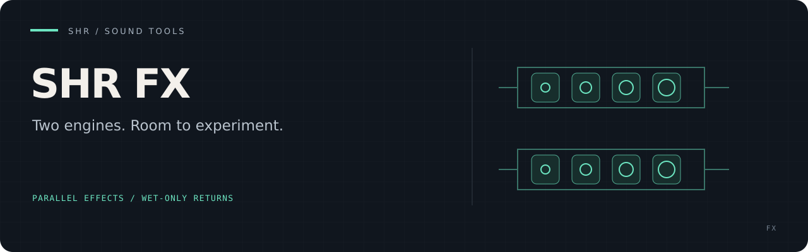
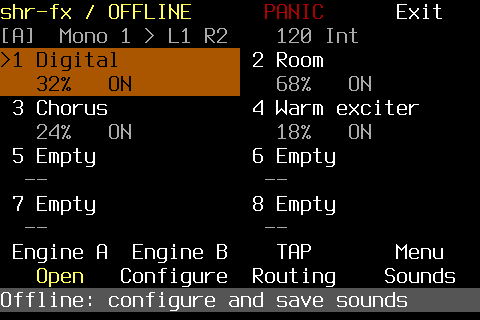
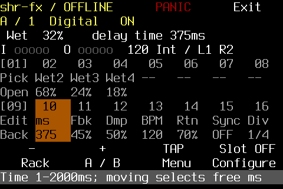

# SHR FX

**A two-engine send-effects rack for a 40×13 touch terminal.** Mix reverb,
delay, chorus and harmonic exciter across up to eight parallel slots per engine.
Your mixer carries the dry signal; SHR FX supplies the wet returns.

[Build and run](#build-and-run) · [Controller guide](docs/INTERFACE.md) · [Screen gallery](docs/screens/README.md) · [Project status](docs/PLAN.md)

## A rack you can touch

<p>
  
  
</p>

Actual offline renderer captures using the terminal font. [Browse all screens](docs/screens/README.md).

- **Two independent engines:** separate sends or a shared input, with mono and stereo return layouts.
- **Parallel sound design:** five reverb profiles, four delay characters, chorus/ensemble and Warm/Bright exciter.
- **Touch and controller operation:** guided MIDI learning, pickup, TAP, sound recall and visible panic/exit.

The software baseline covers DSP, routing, storage and controls. Live listening,
latency and JACK headroom remain separate [acceptance checks](docs/ACCEPTANCE.md).

## Build and run

The exact toolchain is Rust **1.97.1**. Native build requirements are a C
compiler, pkg-config, JACK development headers and ALSA development headers
(on Debian: `build-essential pkg-config libjack-jackd2-dev libasound2-dev`).

```sh
git clone https://github.com/PaolaShultz/shr-fx.git
cd shr-fx
cargo build --release --locked
./target/release/shr-fx
```

Default startup is **offline**: the complete interface, sound storage and
logical routing work without opening JACK or ALSA. No signal is synthesized or
played. The app does not change the terminal font, tty setup or JACK settings.

To enable live audio and MIDI input:

```sh
./target/release/shr-fx --audio --midi
```

Both flags are independent. JACK must already be running; shr-fx never starts,
restarts or reconfigures it. With no saved physical assignments, shr-fx attaches
with unconnected, silent ports. The exact client name is `fx`; an existing
client of that name causes a visible failure instead of a suffixed duplicate.

`--help`, `--version`, `--data-root DIR` and `FX_DATA_ROOT` are supported.
Without an override, data lives in `$XDG_DATA_HOME/fx`, or
`$HOME/.local/share/fx`. Use a private directory outside this checkout.
`local.json` holds physical port identities and controller settings;
`sounds/sound-01.json` through `sound-16.json` hold rack snapshots. No accounts,
network, launcher SDK or sibling repository are required.

### Source-frame DSP integration

The same release build produces `target/release/libshr_fx.so`, with the
[versioned C interface](include/shr_fx.h) for a device-independent stereo wet
return. It reuses the rack's Digital Delay as a fixed 20 ms echo with 0.25
feedback and 0.5 wet gain. The adapter uses native **f64** DSP and retained state
through the shared delay algorithm; the standalone rack retains f32 processing.
The adapter adds no block buffering. At 48 kHz its intentional first tap
is exactly 960 source frames. Hosts own discontinuity reset, wet fades and
source-frame scheduling; see the [ABI contract](docs/ARCHITECTURE.md#versioned-source-frame-adapter).
Additive read-only queries report the fixed capabilities and actual numerical
process/reset history in caller-owned structs. Writable rack controls and hardware
health remain unavailable. See the [owner E07 corpus](tests/fixtures/cfx/v1/README.md).
Loading this library does not open audio/MIDI devices or start the standalone UI.

## Documentation

- [Operating guide](docs/OPERATING_GUIDE.md) — setup, controls, routing and troubleshooting.

[Architecture](docs/ARCHITECTURE.md) · [Current plan](docs/PLAN.md) · [License](LICENSE)
