# Renderer gallery

Generated from `ui::draw` with ratatui TestBackend at 40×13. PNGs use the installed Uni2-TerminusBold24x12 PSF font, read-only VT default palette, and 480×320 canvas (eight bottom pixels unused). These are offline renderer previews, not photographs or hardware acceptance. The meter example uses explicitly simulated peaks.

Regenerate: `python3 scripts/screen_gallery.py` (Pillow needed for this opt-in renderer). No audio files or user configuration are read or written.

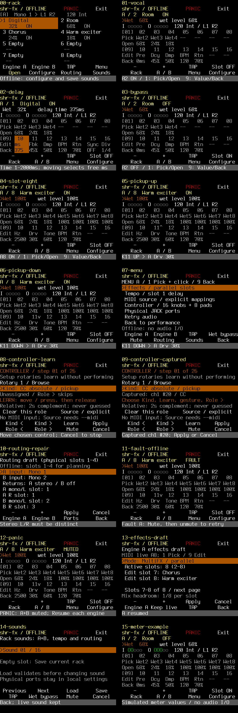

## 00-rack


```text
shr-fx / OFFLINE      PANIC      Exit
[A]  Mono 1 > L1 R2    120 Int
>1 Digital           2 Room
   32%   ON            68%   ON
 3 Chorus            4 Warm exciter
   24%   ON            18%   ON
 5 Empty             6 Empty
  --                  --
 7 Empty             8 Empty
  --                  --
 Engine A  Engine B    TAP       Menu
   Open   Configure  Routing    Sounds
Offline: configure and save sounds
```

## 01-vocal

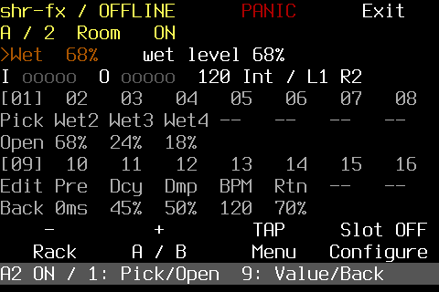

```text
shr-fx / OFFLINE      PANIC      Exit
A / 2  Room   ON
>Wet  68%    wet level 68%
I ooooo  O ooooo  120 Int / L1 R2
[01]  02   03   04   05   06   07   08
Pick Wet2 Wet3 Wet4 --   --   --   --
Open 68%  24%  18%
[09]  10   11   12   13   14   15   16
Edit Pre  Dcy  Dmp  BPM  Rtn  --   --
Back 0ms  45%  50%  120  70%
    -         +        TAP     Slot OFF
   Rack     A / B      Menu   Configure
A2 ON / 1: Pick/Open  9: Value/Back
```

## 02-delay


```text
shr-fx / OFFLINE      PANIC      Exit
A / 1  Digital   ON
 Wet  32%    delay time 375ms
I ooooo  O ooooo  120 Int / L1 R2
[01]  02   03   04   05   06   07   08
Pick Wet2 Wet3 Wet4 --   --   --   --
Open 68%  24%  18%
[09]  10   11   12   13   14   15   16
Edit ms   Fbk  Dmp  BPM  Rtn  Sync Div
Back 375  45%  50%  120  70%  OFF  1/4
    -         +        TAP     Slot OFF
   Rack     A / B      Menu   Configure
Time 1-2000ms; moving selects free ms
```

## 03-bypass

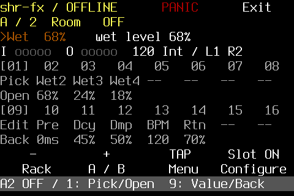

```text
shr-fx / OFFLINE      PANIC      Exit
A / 2  Room   OFF
>Wet  68%    wet level 68%
I ooooo  O ooooo  120 Int / L1 R2
[01]  02   03   04   05   06   07   08
Pick Wet2 Wet3 Wet4 --   --   --   --
Open 68%  24%  18%
[09]  10   11   12   13   14   15   16
Edit Pre  Dcy  Dmp  BPM  Rtn  --   --
Back 0ms  45%  50%  120  70%
    -         +        TAP     Slot ON
   Rack     A / B      Menu   Configure
A2 OFF / 1: Pick/Open  9: Value/Back
```

## 04-slot-eight

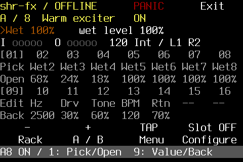

```text
shr-fx / OFFLINE      PANIC      Exit
A / 8  Warm exciter   ON
>Wet 100%    wet level 100%
I ooooo  O ooooo  120 Int / L1 R2
[01]  02   03   04   05   06   07   08
Pick Wet2 Wet3 Wet4 Wet5 Wet6 Wet7 Wet8
Open 68%  24%  18%  100% 100% 100% 100%
[09]  10   11   12   13   14   15   16
Edit Hz   Drv  Tone BPM  Rtn  --   --
Back 2500 30%  60%  120  70%
    -         +        TAP     Slot OFF
   Rack     A / B      Menu   Configure
A8 ON / 1: Pick/Open  9: Value/Back
```

## 05-pickup-up

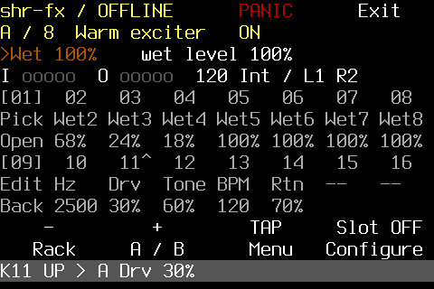

```text
shr-fx / OFFLINE      PANIC      Exit
A / 8  Warm exciter   ON
>Wet 100%    wet level 100%
I ooooo  O ooooo  120 Int / L1 R2
[01]  02   03   04   05   06   07   08
Pick Wet2 Wet3 Wet4 Wet5 Wet6 Wet7 Wet8
Open 68%  24%  18%  100% 100% 100% 100%
[09]  10   11^  12   13   14   15   16
Edit Hz   Drv  Tone BPM  Rtn  --   --
Back 2500 30%  60%  120  70%
    -         +        TAP     Slot OFF
   Rack     A / B      Menu   Configure
K11 UP > A Drv 30%
```

## 06-pickup-down

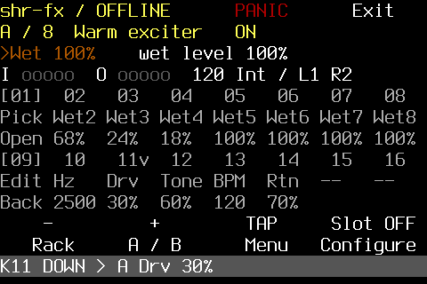

```text
shr-fx / OFFLINE      PANIC      Exit
A / 8  Warm exciter   ON
>Wet 100%    wet level 100%
I ooooo  O ooooo  120 Int / L1 R2
[01]  02   03   04   05   06   07   08
Pick Wet2 Wet3 Wet4 Wet5 Wet6 Wet7 Wet8
Open 68%  24%  18%  100% 100% 100% 100%
[09]  10   11v  12   13   14   15   16
Edit Hz   Drv  Tone BPM  Rtn  --   --
Back 2500 30%  60%  120  70%
    -         +        TAP     Slot OFF
   Rack     A / B      Menu   Configure
K11 DOWN > A Drv 30%
```

## 07-menu

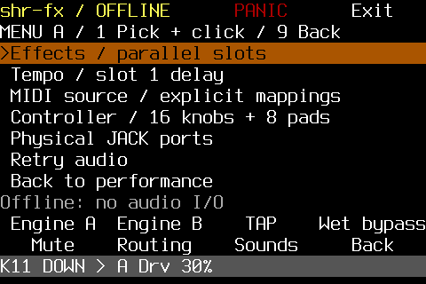

```text
shr-fx / OFFLINE      PANIC      Exit
MENU A / 1 Pick + click / 9 Back
>Effects / parallel slots
 Tempo / slot 1 delay
 MIDI source / explicit mappings
 Controller / 16 knobs + 8 pads
 Physical JACK ports
 Retry audio
 Back to performance
Offline: no audio I/O
 Engine A  Engine B    TAP    Wet bypass
   Mute    Routing    Sounds     Back
K11 DOWN > A Drv 30%
```

## 08-controller-learn

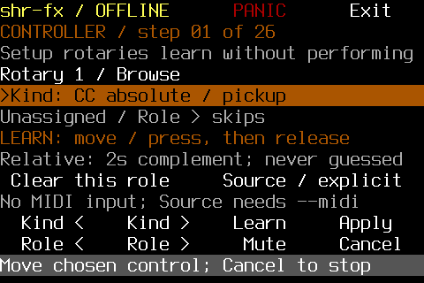

```text
shr-fx / OFFLINE      PANIC      Exit
CONTROLLER / step 01 of 26
Setup rotaries learn without performing
Rotary 1 / Browse
>Kind: CC absolute / pickup
Unassigned / Role > skips
LEARN: move / press, then release
Relative: 2s complement; never guessed
 Clear this role     Source / explicit
No MIDI input; Source needs --midi
  Kind <    Kind >    Learn     Apply
  Role <    Role >     Mute     Cancel
Move chosen control; Cancel to stop
```

## 09-controller-captured

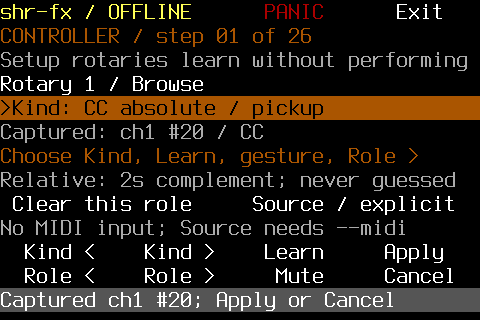

```text
shr-fx / OFFLINE      PANIC      Exit
CONTROLLER / step 01 of 26
Setup rotaries learn without performing
Rotary 1 / Browse
>Kind: CC absolute / pickup
Captured: ch1 #20 / CC
Choose Kind, Learn, gesture, Role >
Relative: 2s complement; never guessed
 Clear this role     Source / explicit
No MIDI input; Source needs --midi
  Kind <    Kind >    Learn     Apply
  Role <    Role >     Mute     Cancel
Captured ch1 #20; Apply or Cancel
```

## 10-routing-repair

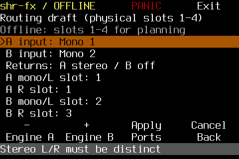

```text
shr-fx / OFFLINE      PANIC      Exit
Routing draft (physical slots 1-4)
Offline: slots 1-4 for planning
>A input: Mono 1
 B input: Mono 2
 Returns: A stereo / B off
 A mono/L slot: 1
 A R slot: 1
 B mono/L slot: 2
 B R slot: 3
    -         +       Apply     Cancel
 Engine A  Engine B   Ports      Back
Stereo L/R must be distinct
```

## 11-fault-offline

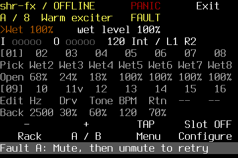

```text
shr-fx / OFFLINE      PANIC      Exit
A / 8  Warm exciter   FAULT
>Wet 100%    wet level 100%
I ooooo  O ooooo  120 Int / L1 R2
[01]  02   03   04   05   06   07   08
Pick Wet2 Wet3 Wet4 Wet5 Wet6 Wet7 Wet8
Open 68%  24%  18%  100% 100% 100% 100%
[09]  10   11v  12   13   14   15   16
Edit Hz   Drv  Tone BPM  Rtn  --   --
Back 2500 30%  60%  120  70%
    -         +        TAP     Slot OFF
   Rack     A / B      Menu   Configure
Fault A: Mute, then unmute to retry
```

## 12-panic

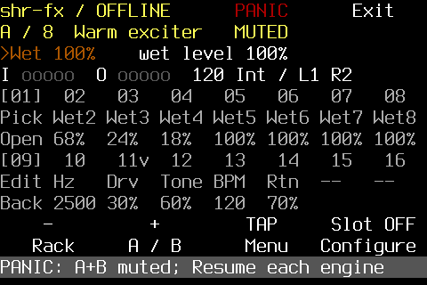

```text
shr-fx / OFFLINE      PANIC      Exit
A / 8  Warm exciter   MUTED
>Wet 100%    wet level 100%
I ooooo  O ooooo  120 Int / L1 R2
[01]  02   03   04   05   06   07   08
Pick Wet2 Wet3 Wet4 Wet5 Wet6 Wet7 Wet8
Open 68%  24%  18%  100% 100% 100% 100%
[09]  10   11v  12   13   14   15   16
Edit Hz   Drv  Tone BPM  Rtn  --   --
Back 2500 30%  60%  120  70%
    -         +        TAP     Slot OFF
   Rack     A / B      Menu   Configure
PANIC: A+B muted; Resume each engine
```

## 13-effects-draft

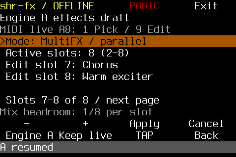

```text
shr-fx / OFFLINE      PANIC      Exit
Engine A effects draft
MIDI live A8; 1 Pick / 9 Edit
>Mode: MultiFX / parallel
 Active slots: 8 (2–8)
 Edit slot 7: Chorus
 Edit slot 8: Warm exciter

 Slots 7-8 of 8 / next page
Mix headroom: 1/8 per slot
    -         +       Apply     Cancel
 Engine A Keep live    TAP       Back
A resumed
```

## 14-sounds

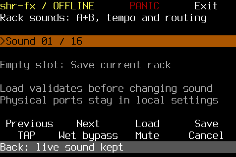

```text
shr-fx / OFFLINE      PANIC      Exit
Rack sounds: A+B, tempo and routing

>Sound 01 / 16

Empty slot: Save current rack

Load validates before changing sound
Physical ports stay in local settings

 Previous    Next      Load      Save
   TAP    Wet bypass   Mute     Cancel
Back; live sound kept
```

## 15-meter-example

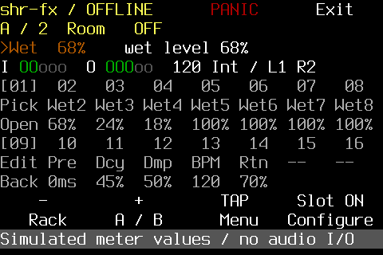

```text
shr-fx / OFFLINE      PANIC      Exit
A / 2  Room   OFF
>Wet  68%    wet level 68%
I OOooo  O OOOoo  120 Int / L1 R2
[01]  02   03   04   05   06   07   08
Pick Wet2 Wet3 Wet4 Wet5 Wet6 Wet7 Wet8
Open 68%  24%  18%  100% 100% 100% 100%
[09]  10   11   12   13   14   15   16
Edit Pre  Dcy  Dmp  BPM  Rtn  --   --
Back 0ms  45%  50%  120  70%
    -         +        TAP     Slot ON
   Rack     A / B      Menu   Configure
Simulated meter values / no audio I/O
```
